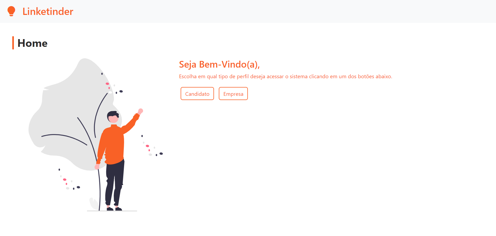

# Projeto Linketinder


The project's goal is to meet the need for a more practical and effective way to identify employees with valuable skills
for a company. The "Linketinder" aims to combine the matching functionality of Tinder with the individual skills section
found on LinkedIn, enhancing the relationship between recruiting companies and candidates.

## Table of Contents

***

1. [About](#about)
2. [Technologies](#technologies)
3. [Installation](#installation)
4. [Running](#running)
5. [Testing](#testing)

## About

***
Initially, a Minimum Viable Product (MVP) of the software will be implemented, utilizing simpler resources.

* Mandatory requirements:

1. The program must maintain an array of candidates with a minimum of 5 pre-registered candidates;
2. For each candidate, it must be possible to save information such as Name, Email, CPF, Age, State, ZIP code, and
   Description;
3. Each candidate has a skills attribute, which is also an array. For now, the skills can be predefined, such as Python,
   Java, Spring Framework, Angular, among others;
4. There should be an array of companies with a minimum of 5 pre-registered companies:
5. For each company, it must be possible to save information such as Name, Corporate Email, CNPJ, Country, State, ZIP
   code, and Description;
6. The company also has a skills attribute, which pertains to what the company expects from the candidates;
7. It is mandatory to implement a simple menu in the terminal, with options to list all companies and all candidates.

* Like System:
1. For each user "like", search in the list of "likes" to see if there is any record where the job already 
has the "company" and "user" fields filled in. If yes, only the "job" field is updated; otherwise, 
create a "like" object with the "user" and "job."

## Technologies

***
A list of technologies used within the project:

* [Groovy](http://www.groovy-lang.org): Version 4.0.14
* [NodeJS](https://nodejs.org/en): Version 18.17.1
* [WebPack](https://webpack.js.org)
* [HTML](https://developer.mozilla.org/pt-BR/docs/Web/HTML)
* [CSS](https://developer.mozilla.org/pt-BR/docs/Learn/Getting_started_with_the_web/CSS_basics)
* [Bootstrap](https://getbootstrap.com): Version: 5.3.2
* [DiceBear](https://www.dicebear.com)

## Installation
***

```bash
$ git clone git@github.com:jeniferss/LinketinderProject.git
```

## Running
***
### Backend

```bash
$ cd src
$ groovy Main
```

### Frontend
```bash
$ cd frontend
npm i -g live-server
npm i --save-dev
npm run build

# Access http://127.0.0.1:8080/src/app.html
```

## Testing

***

Unit tests play an important role in early bug detection by isolating specific parts of code for testing, enabling
developers to rectify issues before they spread system-wide. Simultaneously, they prompt developers to contemplate code
functionality and behavior, fostering the development of cleaner, modular, and sustainable code aligned with best
practices and design principles.

* Mandatory requirements:

1. Create a unit test for the new user registration step (candidate or company).

```bash
$ cd src
$ cd tests
$ groovy RunTest
```